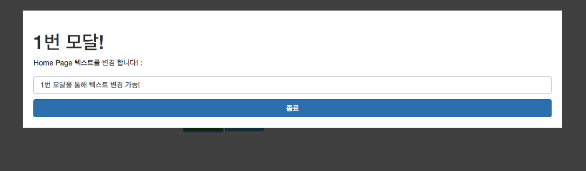
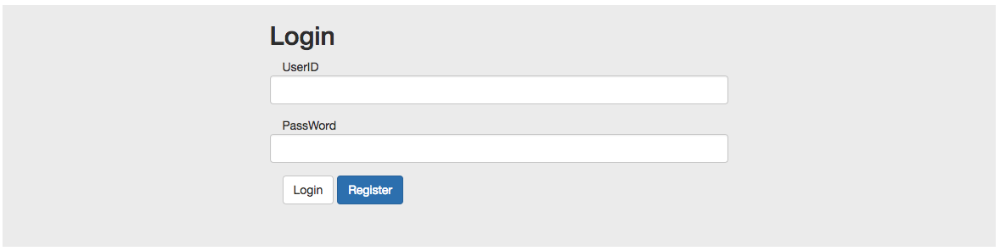

# Angular

> angular를 이용한 프로젝트 

## List

- ### angular 에서 canvas 사용하기

  [canvas-in-angular][]

[canvas-in-angular]: https://github.com/minw1540/TIL/blob/master/Angular/canvas-in-angular.md

- ### angular의 디렉티브를 이용 하여 모달 창 만들기 [custom-modal][]

	참고 : http://jasonwatmore.com/post/2017/01/24/angular-2-custom-modal-window-dialog-box

[custom-modal]: https://github.com/minw1540/TIL/blob/master/Angular/custom-modal

 모달 1번 화면 

 
 

- ### angular의 라우터를 사용하여 로그인 화면과 회원등록 화면을 만들어보자 [login-register][]

	참고 : http://jasonwatmore.com/post/2016/09/29/angular-2-user-registration-and-login-example-tutorial

[login-register]: https://github.com/minw1540/TIL/blob/master/Angular/login-register

 모달 1번 화면 

 

