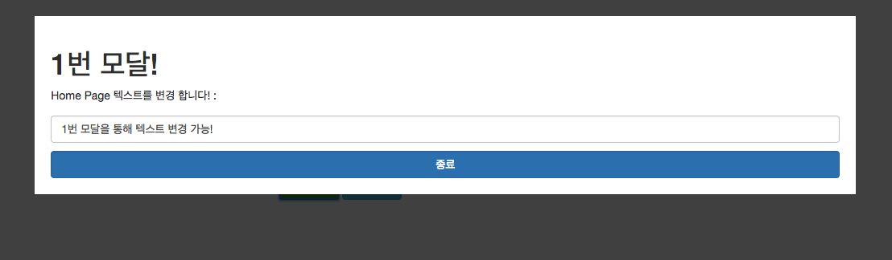

# Angular Custom-Modal
> angular directive 만들기 

> angular routerLink 사용하기

> jQuery & underscorejs 사용 

- angular의 디렉티브를 이용 하여 모달 창 만들기
------------

참고 : http://jasonwatmore.com/post/2017/01/24/angular-2-custom-modal-window-dialog-box

`npm install 이  필요합니다.`

- 메인 화면 

- 모달 1번 화면 

- 모달 2번 화면 

- 모달창 없는 테스트 페이지

### 전체적인 tree

		.
		|____app
		| |_____directives
		| | |____index.ts
		| | |____modal
		| | | |____modal.component.css
		| | | |____modal.component.html
		| | | |____modal.component.spec.ts
		| | | |____modal.component.ts
		| |_____services
		| | |____index.ts
		| | |____modal.service.spec.ts
		| | |____modal.service.ts
		| |____app.component.css
		| |____app.component.html
		| |____app.component.spec.ts
		| |____app.component.ts
		| |____app.module.ts
		| |____app.routing.ts
		| |____home
		| | |____home.component.css
		| | |____home.component.html
		| | |____home.component.spec.ts
		| | |____home.component.ts
		| | |____index.ts
		| |____test-page
		| | |____index.ts
		| | |____test-page.component.css
		| | |____test-page.component.html
		| | |____test-page.component.spec.ts
		| | |____test-page.component.ts
		|____assets
		| |____.gitkeep
		|____environments
		| |____environment.prod.ts
		| |____environment.ts
		|____favicon.ico
		|____index.html
		|____main.ts
		|____polyfills.ts
		|____styles.css
		|____test.ts
		|____tsconfig.app.json
		|____tsconfig.spec.json
		|____typings.d.ts
		

- app.module.ts

		
		import { BrowserModule } from '@angular/platform-browser';
		import { NgModule } from '@angular/core';
		import { FormsModule }    from '@angular/forms';
		
		/*route*/
		import { routing } from './app.routing';
		
		/*service*/
		import { ModalService } from './_services/index';
		
		
		import { AppComponent } from './app.component';
		import { HomeComponent } from './home/home.component';
		import { TestPageComponent } from './test-page/test-page.component';
		import { ModalComponent } from './_directives/index';
		
		@NgModule({
		  declarations: [
		    AppComponent,
		    HomeComponent,
		    TestPageComponent,
		    ModalComponent
		  ],
		  imports: [
		    BrowserModule,
		    routing,
		    FormsModule
		  ],
		  providers: [
		    ModalService
		  ],
		  bootstrap: [AppComponent]
		})
		export class AppModule { }
	

- app.routing.ts

		
		import { Routes, RouterModule } from '@angular/router';
		
		import { HomeComponent } from './home/index';
		import { TestPageComponent } from './test-page/index';
		
		const routes : Routes = [
		    { path : '' , component : HomeComponent },
		    { path : 'test-page' , component : TestPageComponent },
		    { path : '**' , redirectTo : '' }
		];
		
		export const routing = RouterModule.forRoot(routes);
	

- app.component.ts
		
		import { Component } from '@angular/core';
		
		@Component({
		  selector: 'app-root',
		  templateUrl: './app.component.html',
		  styleUrls: ['./app.component.css']
		})
		export class AppComponent {
		  title = 'app';
		}
	

- app.component.html

		
		

		    

		        <nav>
		            <a [routerLink]="['/']">Home</a>
		            <a [routerLink]="['/test-page']">Test Page</a>
		        </nav>
		        <router-outlet></router-outlet>
		
		    

		

		

	
- app.component.css
	
		
		body {
		    font-family: roboto;
		    padding: 20px;
		}
		
		nav {
		    margin-bottom: 20px;
		    padding-bottom: 20px;
		    border-bottom: 1px solid #ddd;
		}
		
		nav > a {
		    margin-right: 8px;
		}
		
		
		h1 {
		    font-weight: normal;
		    margin-top: 0;
		}
		
		input[type="text"] {
		    display:block;
		    width: 100%;
		    font-family: roboto;
		}
		
		.main-container {
		    margin-top: 5%;
		}
		
		

### Service 생성

- _services/modal.service.ts
	
		
		import { Injectable } from '@angular/core';
		
		/*import underscore*/
		import * as _ from 'underscore';
		
		@Injectable()
		export class ModalService {
		
		    private modals : any[] =[];
		
		    add(modal : any) {
		        console.log(modal);
		        this.modals.push(modal);
		        return;
		    }
		
		    remove(id : string) {
		        let modalToRemove = _.findWhere(this.modals , {id : id});
		        this.modals = _.without(this.modals, modalToRemove);
		        return;
		    }
		
		    open(id : string) {
		        let modal = _.findWhere(this.modals, {id : id});
		        modal.open();
		        return;
		    }
		
		    close(id : string) {
		        let modal = _.find(this.modals, {id : id});
		        modal.close();
		        return;
		    }
		
		
		  constructor() { }
		
		}
		

	

- _services/index.ts

		export * from './modal.service';
		

### directive 생성

- _directives/modal/modal.component.ts
	
		import { Component, ElementRef, Input, OnInit, OnDestroy } from '@angular/core';
		
		/*service*/
		import { ModalService } from '../../_services/index';
		
		/*import jquery*/
		import * as $ from 'jquery';
		
		@Component({
		    moduleId : module.id.toString(),
		    selector : 'modal',
		    template : '<ng-content></ng-content>'
		
		})
		export class ModalComponent implements OnInit, OnDestroy {
		
		    @Input() id : string;
		    private element : $;
		
		
		    constructor(
		        private modalService : ModalService,
		        private el : ElementRef
		    ) {
		        this.element = $(el.nativeElement);
		    }
		
		    ngOnInit() : void {
		        let modal = this;
		
		        if(!this.id){
		            console.log('mw : [modal must have an id !!]');
		            return;
		        }
		
		        this.element.appendTo('body');
		
		        // this.element.unbind('click');
		        // this.element.bind('click', function (e : any) {
		        //     var target = $(e.target);
		        //     if(!target.closest('.modal-body').length){
		        //         modal.close();
		        //     }
		
		        // });
		
		        this.modalService.add(this);
		        return;
		    }
		
		    ngOnDestroy() : void {
		        this.modalService.remove(this.id);
		        this.element.remove();
		        return;
		    }
		
		    open() : void {
		        this.element.show();
		        $('body').addClass('modal-open');
		    }
		
		    close() : void {
		        this.element.hide();
		        $('body').removeClass('modal-open');
		    }
		
		
		}
		

- _directives/index.ts

		export * from './modal/modal.component';
		

### home component 생성

- home/home.component.html
		
		
		

		    <h1>Home</h1>
		    
{{bodyText}}

		    <button type="button" class="btn btn-success"
		        (click)="openModal('custom-modal-1')"
		    >
		        1번 모달
		    </button>
		    <button type="button" class="btn btn-info"
		        (click)="openModal('custom-modal-2')"
		    >
		        2번 모달
		    </button>
		

		
		<modal id="custom-modal-1">
		    

		        

		                <h1>1번 모달!</h1>
		                
Home Page 텍스트를 변경 합니다! :

		                

		                <input class="form-control" type="text" value="{{bodyText}}" [(ngModel)]="bodyText" required/>
		                <button type="button" class="btn btn-primary form-control"
		                    style="margin-top: 10px;"
		                    (click)="closeModal('custom-modal-1')"
		                >
		                    종료
		                </button>
		        

		        

		
		    

		</modal>
		
		
		<modal id="custom-modal-2">
		    

		        

		            <h1 style="height:100px">모달모달모달~</h1>
		            <button type="button" class="btn btn-primary"
		                (click)="closeModal('custom-modal-2')"
		            >
		                종료
		            </button>
		        

		    

		    

		</modal>
	
	
- home/home.component.css

		
		
		modal {
		    display: none;
		}
		
		.modal {
		    position: fixed;
		    top: 0;
		    right: 0;
		    bottom: 0;
		    left: 0;
		    display: block;
		    z-index: 1000;
		    overflow: auto;
		}
		
		.modal-body {
		    padding: 20px;
		    background: #fff;
		    margin: 40px;
		    z-index: 10;
		}
		
		
		.modal-background {
		    position: fixed;
		    top: 0;
		    right: 0;
		    bottom: 0;
		    left: 0;
		    background-color: #000;
		    opacity: 0.75;
		    z-index: 5;
		}
		
		
		body.modal-open {
		    overflow: hidden;
		}
		

- home/home.component.ts
	
		import { Component, OnInit } from '@angular/core';
		
		/*service*/
		import { ModalService } from '../_services/index';
		
		@Component({
		    moduleId : module.id.toString(),
		    templateUrl: './home.component.html',
		    styleUrls: ['./home.component.css']
		})
		export class HomeComponent implements OnInit {
		
		    bodyText : string;
		
		    constructor(
		        private modalService : ModalService
		    ) { }
		
		    ngOnInit() {
		        this.bodyText = '1번 모달을 통해 텍스트 변경 가능!';
		        return;
		    }
		
		    openModal(id : string) {
		        this.modalService.open(id);
		        return;
		    }
		
		    closeModal(id : string) {
		        this.modalService.close(id);
		        return;
		    }
		
		}

### test-page component 생성

- test-page/test-page.component.html

		
		

		    <h1>Test Page</h1>
		    
이곳에는 모달이 없습니다!!

		

				

- test-page/test-page.component.ts
		
		import { Component } from '@angular/core';
		
		@Component({
		    moduleId : module.id.toString(),
		    templateUrl: './test-page.component.html',
		    styleUrls: ['./test-page.component.css']
		})
		export class TestPageComponent {
		
		    constructor() { }
		}
	
