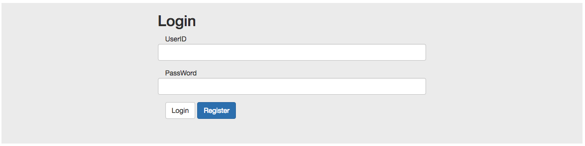

# Angular Login - Register
> angular의 라우터 사용하기!

- angular의 라우터를 사용하여 로그인 화면과 회원등록 화면을 만들어보자!
----------

참고 : http://jasonwatmore.com/post/2016/09/29/angular-2-user-registration-and-login-example-tutorial

`npm install 이  필요합니다.`

- 메인 로그인 화면 

- 등록 화면 

- 등록 완료 화면 

- 등록 결과 화면

### 전체적인 tree

		|____app
		| |_____models
		| | |____user.ts
		| | |____userList.ts
		| |____app.component.css
		| |____app.component.html
		| |____app.component.spec.ts
		| |____app.component.ts
		| |____app.module.ts
		| |____app.routing.ts
		| |____home
		| | |____home.component.css
		| | |____home.component.html
		| | |____home.component.spec.ts
		| | |____home.component.ts
		| |____login
		| | |____login.component.css
		| | |____login.component.html
		| | |____login.component.spec.ts
		| | |____login.component.ts
		| |____register
		| | |____register.component.css
		| | |____register.component.html
		| | |____register.component.spec.ts
		| | |____register.component.ts
		| |____user.service.spec.ts
		| |____user.service.ts
		|____assets
		| |____.gitkeep
		|____environments
		| |____environment.prod.ts
		| |____environment.ts
		|____favicon.ico
		|____index.html
		|____main.ts
		|____polyfills.ts
		|____styles.css
		|____test.ts
		|____tsconfig.app.json
		|____tsconfig.spec.json
		|____typings.d.ts

- app.component.html 

		<router-outlet></router-outlet>
		

- app.module.ts

		import { BrowserModule } from '@angular/platform-browser';
		import { NgModule } from '@angular/core';
		import { FormsModule } from '@angular/forms';
		import { HttpModule } from '@angular/http';
		
		/*routing*/
		import { AppRouting } from './app.routing';
		
		/*service*/
		import { UserService } from './user.service';
		
		import { AppComponent } from './app.component';
		import { LoginComponent } from './login/login.component';
		import { RegisterComponent } from './register/register.component';
		import { HomeComponent } from './home/home.component';
		
		@NgModule({
		  declarations: [
		    AppComponent,
		    LoginComponent,
		    RegisterComponent,
		    HomeComponent
		  ],
		  imports: [
		    BrowserModule,
		    FormsModule,
		    HttpModule,
		    AppRouting
		  ],
		  providers: [
		    UserService
		  ],
		  bootstrap: [AppComponent]
		})
		export class AppModule { }

- app.routing.ts (라우터 생성)
	
		import { RouterModule, Routes } from '@angular/router';
		
		/*import Component*/
		import { LoginComponent } from './login/login.component';
		import { RegisterComponent } from './register/register.component';
		import { HomeComponent } from './home/home.component';
		
		const routes : Routes = [
		    { path : '' , component : LoginComponent },
		    { path : 'register' , component : RegisterComponent },
		    { path : 'home' , component : HomeComponent }
		];
		
		export const AppRouting = RouterModule.forRoot(routes);
		

### Model 생성

- _models/user.ts

		export class User {
		    userNumber : number;
		    userId : string;
		    userPwd : string;
		    userName : string;
		}

- userList.ts

		import { User } from './user';
		
		export const UserList : User[] = [];

### Service 생성

- user.service.ts
	
		
		import { Injectable } from '@angular/core';
		
		/*import models*/
		import { User } from './_models/user';
		import { UserList } from './_models/UserList';
		
		
		@Injectable()
		export class UserService {
		
		    constructor() { }
		
		    /*find user with id*/
		    checkUserId(userId : string) : Promise<User> {
		        return this.getUserList()
		                .then(userList =>
		                    userList.find(user => user.userId === userId)
		            );
		    }
		
		    /*find user with id & pwd*/
		    getUser(userId : string, userPwd : string) : Promise<User> {
		        return this.getUserList()
		                .then(userList =>
		                    userList.find(user =>
		                    user.userId === userId && user.userPwd === userPwd
		                )
		            );
		    }
		
		    /*user list*/
		    getUserList() : Promise<User[]>{
		        return Promise.resolve(UserList);
		    }
		
		    /*set addd list*/
		    setAddUser(userId : string, userPwd : string, userName : string) {
		        let _userListLength = UserList.length;
		        let setUserParam = {
		            userNumber : _userListLength + 1,
		            userId : userId,
		            userPwd : userPwd,
		            userName : userName
		        };
		
		        UserList.push(setUserParam);
		
		    }
		
		
		}
		
				

### login component 생성

- login/login.component.html

	
		

		    

		
		        <h2>Login</h2>
		
		        

		                UserID
		                <input #userId type="text" class="form-control" />
		                
		                    * ID를 입력해주세요!
		                
		                
		                    * 존재하지 않는 ID입니다.
		                
		
		        

		
		        

		                PassWord
		                <input #userPwd type="password" class="form-control" />
		                
		                    * PWD를 입력해주세요!
		                
		        

		
		        

		            <button type="button" class="btn btn-default" (click)="onLogin(userId, userPwd)">Login</button>
		            <button type="button" class="btn btn-primary" (click)="goRegister()">Register</button>
		        

		
		    

		
		

		

- login/login.component.css

		
		.login-container {
		    background: #eee;
		    margin-top: 10%;
		    padding-bottom: 50px;
		}
		
		.login-warning-tool-tip {
		    color: coral;
		    display: none;
		}
		
		.login-warning-tool-tip.active {
		    display: block;
		}
		
	
			
- login/login.component.ts

		
		import { Component, OnInit } from '@angular/core';
		import { Router } from '@angular/router';
		
		/*service*/
		import { UserService } from '../user.service';
		
		@Component({
		    selector: 'app-login',
		    templateUrl: './login.component.html',
		    styleUrls: ['./login.component.css']
		})
		export class LoginComponent implements OnInit {
		
		    _loginWarning : any = {
		        userId : false,
		        userPwd : false,
		        unknownUserId : false
		    };
		
		    constructor(
		        private _router : Router,
		        private _userService : UserService
		    ) { }
		
		    //로그인 함수
		    onLogin(userIdElem : HTMLInputElement, userPwdElem : HTMLInputElement) : void {
		
		        //툴팁 변수 초기화
		        this._loginWarning = {
		            userId : false,
		            userPwd : false,
		            unknownUserId : false
		        };
		
		        let _userId = userIdElem.value.trim();
		        let _userPwd = userPwdElem.value.trim();
		
		        if(_userId === '' || _userId === null){
		            console.log('user id is empty');
		            userIdElem.focus();
		            this._loginWarning.userId = true;
		            return;
		        }
		
		        if(_userPwd === '' || _userPwd === null){
		            console.log('user pwd is empty');
		            userPwdElem.focus();
		            this._loginWarning.userPwd = true;
		            return;
		        }
		
		
		        this._userService.getUser(_userId, _userPwd)
		            .then((r_user) => {
		
		                if(typeof r_user === 'undefined'){
		                    console.log('unknown user id');
		                    userIdElem.focus();
		                    this._loginWarning.unknownUserId = true;
		                    return;
		                }
		
		                this._router.navigate(['/home']);
		                return;
		            });
		
		        return;
		    }
		
		    //등록 페이지 이동 함수
		    goRegister() {
		        this._router.navigate(['/register']);
		        return;
		    }
		
		    ngOnInit() {
		        console.log('mw : [ init Login Page !!]');
		    }
		
		}
		
	
	
	

		
		
### register component 생성

- register/register.component.html

		
		

		    

		
		        <h2>Register</h2>
		
		        

		            UserId
		            <input #userId type="text" class="form-control" />
		            
		                * ID를 입력해주세요!
		            
		            
		                * 이미 존재하는 ID 입니다.
		            
		        

		
		        

		            UserPwd
		            <input #userPwd type="password" class="form-control" />
		            
		                * Pwd를 입력해주세요!
		            
		        

		
		        

		            UserName
		            <input #userName type="text" class="form-control" />
		            
		                * Name를 입력해주세요!
		            
		        

		
		        

		            <button type="button" class="btn btn-primary" (click)="onRegister(userId, userPwd, userName)">Register</button>
		            <button type="button" class="btn btn-default" (click)="goLogin()">Cancel</button>
		        

		
		    

		
		

		

- register/register.component.css

		
		.regiset-container {
		    background: #eee;
		    margin-top: 10%;
		    padding-bottom: 50px;
		}
		
		.register-warning-tool-tip {
		    color: coral;
		    display: none;
		}
		
		.register-warning-tool-tip.active {
		    display: block;
		}
	

- register.component.ts

		
		import { Component, OnInit } from '@angular/core';
		import { Router } from '@angular/router';
		
		/*service*/
		import { UserService } from '../user.service';
		
		
		@Component({
		  selector: 'app-register',
		  templateUrl: './register.component.html',
		  styleUrls: ['./register.component.css']
		})
		export class RegisterComponent implements OnInit {
		
		    _registerWarning : any = {
		        userId : false,
		        alreadyUsedId : false,
		        userPwd : false,
		        userName : false
		    };
		
		    constructor(
		        private _router : Router,
		        private _userService : UserService
		    ) { }
		
		    onRegister(userIdElem : HTMLInputElement, userPwdElem : HTMLInputElement, userNameElem : HTMLInputElement) : void {
		
		        //툴팁 변수 초기화
		        this._registerWarning = {
		            userId : false,
		            alreadyUsedId : false,
		            userPwd : false,
		            userName : false
		        };
		
		        let _userId = userIdElem.value.trim();
		        let _userPwd = userPwdElem.value.trim();
		        let _userName = userNameElem.value.trim();
		
		        if(_userId === '' || _userId === null){
		            console.log('user id is empty');
		            userIdElem.focus();
		            this._registerWarning.userId = true;
		            return;
		        }
		
		        if(_userPwd === '' || _userPwd === null){
		            console.log('user pwd is empty');
		            userPwdElem.focus();
		            this._registerWarning.userPwd = true;
		            return;
		        }
		
		        if(_userName === '' || _userName === null){
		            console.log('user name is empty');
		            userNameElem.focus();
		            this._registerWarning.userName = true;
		            return;
		        }
		        this._userService.checkUserId(_userId)
		            .then((r_user) => {
		
		                if(typeof r_user !== 'undefined'){
		                    console.log('already used this id');
		                    userIdElem.focus();
		                    this._registerWarning.alreadyUsedId = true;
		                    return;
		                }
		
		                this.setUser(_userId, _userPwd, _userName);
		                return;
		            });
		        return;
		    }
		
		    setUser(_userId : string, _userPwd : string, _userName : string) : void {
		        this._userService.setAddUser(_userId, _userPwd, _userName);
		        alert('가입 성공!');
		        this._router.navigate(['/']);
		        return;
		    }
		
		    //로그인 페이지로 이동
		    goLogin() {
		        this._router.navigate(['/']);
		        return;
		    }
		
		    ngOnInit() {
		        console.log('mw : [init Register Page !!]');
		    }
		
		}
		
		
	
	

		

### home component 생성

- home/home.component.html

		

		    

		
		        <h2>User List</h2>
		
		        <ul class="col-md-12">
		            <li class="col-md-12">
		                No
		                ID
		                Pwd
		                Name
		            </li>
		        </ul>
		
		        <ul class="col-md-12">
		            <li class="col-md-12 user-list-box"
		                *ngFor="let user of userList"
		            >
		                {{user.userNumber}}
		                {{user.userId}}
		                {{user.userPwd}}
		                {{user.userName}}
		            </li>
		        </ul>
		
		        

		            <button type="button" class="btn btn-primary" (click)="onBack()">back</button>
		        

		
		
		    

		
		
	

- home/home.component.css

	
		ol, ul {
		    list-style: none;
		}
		
		.home-container {
		    background: #eee;
		    margin-top: 10%;
		    padding-bottom: 50px;
		}
		
		.user-info-title {
		    height: 50px;
		    font-size: 15px;
		    text-align: center;
		    line-height: 50px;
		}
		
		.user-info-text {
		    height: 30px;
		    font-size: 12px;
		    text-align: center;
		    line-height: 30px;
		    cursor: pointer;
		}
		
		.user-list-box:hover {
		    background: #ddd;
		    border-radius: 20px;
		}
		

- home/home.component.ts

	
		import { Component, OnInit } from '@angular/core';
		import { Router } from '@angular/router';
		
		/*service*/
		import { UserService } from '../user.service';
		
		/*model*/
		import { User } from '../_models/user';
		
		@Component({
		  selector: 'app-home',
		  templateUrl: './home.component.html',
		  styleUrls: ['./home.component.css']
		})
		export class HomeComponent implements OnInit {
		
		    userList : User[];
		
		    constructor(
		        private _router : Router,
		        private _userService : UserService
		    ) { }
		
		    getUserList() {
		        this._userService.getUserList()
		            .then((r_userList) => {
		                console.log(r_userList);
		                this.userList = r_userList;
		            });
		    }
		
		    onBack() {
		        this._router.navigate(['/']);
		        return;
		    }
		
		    ngOnInit() {
		        this.getUserList();
		        return;
		    }
		
		}
		
