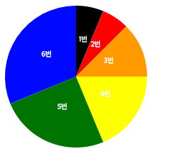

# D3.js

> D3.js를 이용하여 그래프 만들기
 

## List

- [Pie Chart][]

[Pie Chart]: https://github.com/minw1540/TIL/blob/master/D3/pie-donut-chart.md

- [Bar Chart][]

[Bar Chart]: https://github.com/minw1540/TIL/blob/master/D3/bar-chart.md

- [Line Chart][]

[Line Chart]: https://github.com/minw1540/TIL/blob/master/D3/line-dot-chart.md

- [asymmetry-pie-chart][] pie chart 응용 버전

[asymmetry-pie-chart]: https://github.com/minw1540/TIL/blob/master/D3/asymmetry-pie-chart.md

### HTML Sample Code

- [d3js-sample.html][]

[d3js-sample.html]: https://github.com/minw1540/TIL/blob/master/D3/d3js-sample.html
