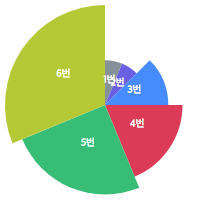

# d3.js-sample - Asymmetry-Pie Chart
> D3.js를 이용하여 그래프를 그리자!
> 
> Asymmetry-Pie Chart (Pie Chart 응용 버전)
> 

	데이터는 간단하게
	
	var dumpData = {
		0 : 10,
		1 : 10,
		2 : 20,
		3 : 30,
		4 : 40,
		5 : 50,
	};
	
	해당 형식으로 사용하였습니다.

	
- Asymmetry-Pie Chart
----------
### 4. Asymmetry-Pie Chart

html

	

        

            <svg id="asymmetryChart"></svg>
        
	
	

	

js

	/**
	 * 차트 생성 함수 호출
	 * graph container id, graph svg id, 그래프 넓이, 그래프 높이, 그래프 데이터
	 */
	 asymmetryGraph('graphContents', 'asymmetryChart', 200, 200, dumpData);
	 

    /**
     * [asymmetryGraph description]
     * 비대칭 파이차트
     * @param  {[string]}  containerID [graph container id]
     * @param  {[string]}  graphID     [graph svg id]
     * @param  {[number]}  graphWidth  [그래프 넓이]
     * @param  {[number]}  graphHeight [그래프 높이]
     * @param  {[any]}  graphData   [그래프 데이터]
     */
    function asymmetryGraph(containerID, graphID, graphWidth, graphHeight, graphData) {

        var _svgContainer = undefined;

        _svgContainer = d3.select('#' + containerID)
            .select('#'+graphID)
            .attr({
                'id': graphID,
                'class' : 'svg',
                'width': graphWidth,
                'height': graphHeight
        });

        _svgContainer.append('g')
                    .attr('id', graphID + 'Group')
                    .attr('transform', 'translate(' + graphWidth/2 + ', ' + graphHeight/2 + ')');

        var dataColor = ['red', 'orange', 'yellow', 'green', 'blue', 'black'];
        var radius = Math.min(graphWidth, graphHeight)/2;
        var dataRange = [];

        for(var ii in graphData){
            dataRange.push(graphData[ii]);
        }

        var color = d3.scale.ordinal()
              .domain(dataRange)
              .range(dataColor);

        var radiusScale = d3.scale.sqrt().range([0, radius]);
        radiusScale.domain([0, d3.max(dataRange, function (dd){ return dd; })]);

        var pie = d3.layout.pie()
                        .value(function(dd, ii) {
                            return dd;
                        })
                        .sort(null);

        var arc = d3.svg.arc()
                        .outerRadius(function(dd) {
                          return radiusScale(dd.data);
                        })
                        .innerRadius(0);

        var chart = d3.select('#' + graphID + 'Group')
            .selectAll('path')
            .data(pie(dataRange))
            .enter()
            .append('path')
            .attr('d', arc)
            .attr('fill', function (dd, ii){
                return color(ii);
            })
            .style('opacity', 0);

        chart.transition()
            .delay(function(dd, ii) {
                return ii * ((dataRange.length/2) * 100);
            })
            .duration(((dataRange.length/2) * 100))
            .style('opacity', 1)
            .attrTween('d', function(dd) {
               var inter = d3.interpolate(dd.startAngle+0.1, dd.endAngle);
               return function(tt) {
                   dd.endAngle = inter(tt);
                 return arc(dd);
               }
            });

        //텍스트
        d3.select('#' + graphID + 'Group')
            .selectAll('text.peopletext')
            .data(pie(dataRange))
            .enter()
            .append('text')
            .attr('class', 'people-text')
            .attr('text-anchor', 'middle')
            .attr('d', arc)
            .attr("transform", function(d) {
                return "translate(" + arc.centroid(d) + ")";
            })
            .style('fill', '#fff')
            .style('font-size', '10px')
            .text(function(dd, ii) {
                return Number(ii) + 1 + '번';
            });

        return;
    }