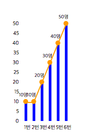

# d3.js-sample - Bar Chart
> D3.js를 이용하여 그래프를 그리자!
> 
> Bar Chart

	데이터는 간단하게
	
	var dumpData = {
		0 : 10,
		1 : 10,
		2 : 20,
		3 : 30,
		4 : 40,
		5 : 50,
	};
	
	해당 형식으로 사용하였습니다.

- Bar Chart
----------
### 2. Bar Chart

html

	

        

            <svg id="barChart"></svg>
        
	
	

	

js

	/**
	 * 차트 생성 함수 호출
	 * graph container id, graph svg id, 그래프 넓이, 그래프 높이, 그래프 데이터, 그래프 여백, 라인 사용 여부
	 */
	 barGraph('graphContents', 'barChart', 200, 300, dumpData, 50, false);
	 
	 
    /**
     * [barGraph description]
     * 바 차트
     * @param  {[string]}  containerID [graph container id]
     * @param  {[string]}  graphID     [graph svg id]
     * @param  {[number]}  graphWidth  [그래프 넓이]
     * @param  {[number]}  graphHeight [그래프 높이]
     * @param  {[any]}  graphData   [그래프 데이터]
     * @param  {[number]} graphMargin [그래프 여백]
     * @param  {[boolean]} useLine     [라인 사용 여부]
     */
    function barGraph(containerID, graphID, graphWidth, graphHeight, graphData, graphMargin, useLine) {

        var _svgContainer = undefined;

        _svgContainer = d3.select('#' + containerID)
            .select('#'+ graphID)
            .attr({
                'id': graphID,
                'class' : 'svg',
                'width': graphWidth,
                'height': graphHeight
        });

        var article = [];
        var personNum = [];

        for(var ii in graphData){
            article.push(Number(ii));
            personNum.push(graphData[ii]);
        }

        // X축 설정
        var xScale = d3.scale.ordinal()
                       .domain(article)
                       .rangeBands([graphMargin, graphWidth - graphMargin ]);

        var xAxis = d3.svg.axis()
                      .scale(xScale)
                      .tickFormat(function(dd) { return Number(dd) + 1 + '번'; })
                      .outerTickSize(0)
                      .orient('bottom');

        d3.select('#'+ graphID)
            .append('g')
            .attr('id', graphID + 'xAxisG')
            .attr('class', 'bar-braph-xAxis-g')
            .call(xAxis);

        d3.selectAll('#'+ graphID + 'xAxisG')
            .attr('transform', 'translate(0, ' + (graphHeight - graphMargin)  + ')');

        // Y축 설정
        var maxPersonNum = d3.max(personNum, function(dd) { return Number(dd); });
        var yScale = d3.scale.linear()
                        .domain([0, maxPersonNum])
                        .range([graphHeight - graphMargin, graphMargin]);

        // y Axis - 라인 사용시에만 사용
        if(useLine){
            var yAxis = d3.svg.axis()
                          .scale(yScale)
                          .outerTickSize(0)
                          .orient('left');

            d3.select('#'+ graphID)
                .append('g')
                .attr('id', graphID + 'yAxisG')
                .attr('class', 'bar-braph-yAxis-g')
                .call(yAxis);

            d3.selectAll('#'+ graphID + 'yAxisG')
                .attr('transform', 'translate(' + graphMargin+ ', 0)');
        }

        var widthRange = (xScale.range()[1] - xScale.range()[0])/3;
        var transformRange = (xScale.range()[1] - xScale.range()[0])/2 - widthRange;

        //bar
        d3.select('#'+ graphID)
            .selectAll('rect.bar')
            .data(article)
            .enter()
            .append('rect')
            .attr('class', function(dd) {
                return 'rect-bar';
            })
            .attr('transform', function (dd) {
                return 'translate(' + transformRange + ',0)';
            })
            .attr('width', widthRange)
            .attr('height', function(dd, ii) { return graphHeight - graphMargin - yScale(parseInt(personNum[ii]));})
            .attr('x', function (dd, ii) { return xScale(dd); })
            .attr('y', function (dd, ii) { return yScale(personNum[ii]); })
            .style('fill', 'blue');

        //텍스트
        d3.select('#'+ graphID)
            .selectAll('text.peopletext')
            .data(article)
            .enter()
            .append('text')
            .attr('class', 'people-text')
            .attr('text-anchor', 'middle')
            .style('font-size', '10px')
            .attr('dx', function(dd, ii) {
                return xScale(dd);
            })
            .attr('dy', function(dd, ii) {
                return yScale(personNum[ii]) - 10;
            })
            .text(function(dd, ii) {
                return personNum[ii] + '명';
            });

        if(useLine){
            //점
            d3.select('#'+ graphID)
                .selectAll('circle.person-num')
                .data(article)
                .enter()
                .append('circle')
                .attr('class', 'person-num')
                .attr('r', 5)
                .attr('cx', function (dd, ii) { return xScale(dd) + 5; })
                .attr('cy', function (dd, ii) { return yScale(personNum[ii]); })
                .style('fill', 'orange');

            //라인
            var personNumLine = d3.svg.line()
                .x(function (dd, ii) {return xScale(dd) + 5; })
                .y(function (dd, ii) { return yScale(personNum[ii]) + 2; });

            d3.select('#'+ graphID)
                .append('path')
                .attr('d', personNumLine(article))
                .attr('fill', 'none')
                .attr('stroke', 'orange')
                .attr('stroke-width', '2');
        }

        return;
    }

해당 함수에 useLine를 true로 변경해주면 그래프에 라인이 생긴다.

	barGraph('graphContents', 'barLineChart', 200, 300, dumpData, 50, true);

