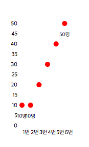

# d3.js-sample - Line, dot Chart
> D3.js를 이용하여 그래프를 그리자!
> 
> Line, dot Chart
> 

	데이터는 간단하게
	
	var dumpData = {
		0 : 10,
		1 : 10,
		2 : 20,
		3 : 30,
		4 : 40,
		5 : 50,
	};
	
	해당 형식으로 사용하였습니다.

- Line, dot Chart
----------
### 3. Line, dot Chart

html

	

        

            <svg id="lineChart"></svg>
        
	
	

	
	
js
	
	/**
	 * 차트 생성 함수 호출
	 * graph container id, graph svg id, 그래프 넓이, 그래프 높이, 그래프 데이터, 그래프 여백, 라인 사용 여부
	 */
	 lineGraph('graphContents', 'lineChart', 200, 300, dumpData, 50, true);
	 

    /**
     * [barGraph description]
     * 라인, 도트 차트
     * @param  {[string]}  containerID [graph container id]
     * @param  {[string]}  graphID     [graph svg id]
     * @param  {[number]}  graphWidth  [그래프 넓이]
     * @param  {[number]}  graphHeight [그래프 높이]
     * @param  {[any]}  graphData   [그래프 데이터]
     * @param  {[number]} graphMargin [그래프 여백]
     * @param  {[boolean]} useLine     [라인 사용 여부]
     */
    function lineGraph(containerID, graphID, graphWidth, graphHeight, graphData, graphMargin, useLine) {

        var _svgContainer = undefined;

        _svgContainer = d3.select('#' + containerID)
            .select('#'+graphID)
            .attr({
                'id': graphID,
                'class' : 'svg',
                'width': graphWidth,
                'height': graphHeight
        });

        var article = [];
        var personNum = [];

        for(var ii in graphData){
            article.push(Number(ii));
            personNum.push(graphData[ii]);
        }

        var maxPersonNum = d3.max(personNum, function(dd) { return Number(dd); });
        var minPersonNum = d3.min(personNum, function(dd) { return Number(dd); });

        // X축 설정
        var xScale = d3.scale.ordinal()
                       .domain(article)
                       .rangeBands([graphMargin, graphWidth - graphMargin ]);

        var xAxis = d3.svg.axis()
                      .scale(xScale)
                      .tickFormat(function(dd) { return Number(dd) + 1 + '번'; })
                      .outerTickSize(0)
                      .orient('bottom');

        d3.select('#'+ graphID)
            .append('g')
            .attr('id', graphID + 'xAxisG')
            .attr('class', 'bar-braph-xAxis-g')
            .call(xAxis);

        d3.selectAll('#'+ graphID + 'xAxisG')
            .attr('transform', 'translate(0, ' + (graphHeight - graphMargin)  + ')');

        // Y축 설정
        var yScale = d3.scale.linear()
                        .domain([0, maxPersonNum])
                        .range([graphHeight - graphMargin, graphMargin]);

        var yAxis = d3.svg.axis()
                      .scale(yScale)
                      .outerTickSize(0)
                      .orient('left');

        d3.select('#'+ graphID)
            .append('g')
            .attr('id', graphID + 'yAxisG')
            .attr('class', 'bar-braph-yAxis-g')
            .call(yAxis);

        d3.selectAll('#'+ graphID + 'yAxisG')
            .attr('transform', 'translate(' + graphMargin+ ', 0)');

        var clickRange = (xScale.range()[1] - xScale.range()[0]);

        //영역
        d3.select('#'+ graphID)
            .selectAll('rect.line-area')
            .data(article)
            .enter()
            .append('rect')
            .style('fill', 'rgba(255, 255, 255, 0)')
            .attr('class', 'line-area')
            .attr('width', clickRange)
            .attr('height', graphHeight - graphMargin * 2)
            .attr('transform', function(dd) {
                return 'translate(' + ((xScale(dd) - clickRange/2)) + ', ' + graphMargin + ')';
            });

        //점
        d3.select('#'+ graphID)
            .selectAll('circle.person-num')
            .data(article)
            .enter()
            .append('circle')
            .attr('class', 'person-num')
            .attr('r', 5)
            .attr('cx', function (dd, ii) { return xScale(dd); })
            .attr('cy', function (dd, ii) { return yScale(personNum[ii]); })
            .style('fill', 'red');

        if(useLine){
            //라인
            var personNumLine = d3.svg.line()
                .x(function (dd, ii) {return xScale(dd); })
                .y(function (dd, ii) { return yScale(personNum[ii]); });

            d3.select('#'+ graphID)
                .append('path')
                .attr('d', personNumLine(article))
                .attr('fill', 'none')
                .attr('stroke', 'red')
                .attr('stroke-width', '2');
        }else{
            //도트 (라인 사용 x)
            // 최대, 최소값만 텍스트 처리
            d3.select('#'+ graphID)
                .selectAll('text.peopletext')
                .data(article)
                .enter()
                .append('text')
                .attr('class', 'people-text')
                .attr('text-anchor', 'middle')
                .style('display', function (dd,ii) {

                    var result = 'none';

                    if(personNum[ii] === maxPersonNum || personNum[ii] === minPersonNum){
                        result = 'block';
                    }

                    return result;
                })
                .style('font-size', '10px')
                .attr('dx', function(dd, ii) {
                    return xScale(dd);
                })
                .attr('dy', function(dd, ii) {
                    return yScale(personNum[ii]) + 25;
                })
                .text(function(dd, ii) {
                    return personNum[ii] + '명';
                });
        }
        return;
    }
 
	
	

해당 함수에 useLine를 false로 변경해주면 라인이 사라지고 dot만 남는다.

	lineGraph('graphContents', 'dotChart', 200, 300, dumpData, 50, false);

