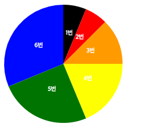
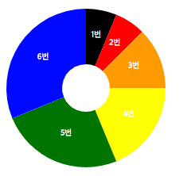
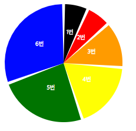
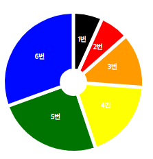

# d3.js-sample - Pie, Donut Chart
> D3.js를 이용하여 그래프를 그리자!
> 
> Pie, Donut Chart

	데이터는 간단하게
	
	var dumpData = {
		0 : 10,
		1 : 10,
		2 : 20,
		3 : 30,
		4 : 40,
		5 : 50,
	};
	
	해당 형식으로 사용하였습니다.

- Pie, Donut Chart
----------
### 1. Pie Chart

html

	

        

            <svg id="pieChart"></svg>
        
	
	

	

js
		
	/**
	 * 차트 생성 함수 호출
	 * graph container id, graph svg id, 그래프 넓이, 그래프 높이, 그래프 데이터, 도넛 크기, 차트 조각 내기(?) 사용 여부
	 */
	pieGraph('graphContents', 'pieChart', 200, 200, dumpData, 0, false);

    /**
     * [pieGraph description]
     * 파이, 도넛 차트
     * @param  {[string]}  containerID [graph container id]
     * @param  {[string]}  graphID     [graph svg id]
     * @param  {[number]}  graphWidth  [그래프 넓이]
     * @param  {[number]}  graphHeight [그래프 높이]
     * @param  {[any]}  graphData   [그래프 데이터]
     * @param  {[number]}  donutSize   [도넛 크기]
     * @param  {[boolean]}  useAngle    [차트 조각 내기(?) 사용 여부]
     */
    function pieGraph(containerID, graphID, graphWidth, graphHeight, graphData, donutSize, useAngle) {

        var _svgContainer = undefined;

        _svgContainer = d3.select('#' + containerID)
            .select('#'+graphID)
            .attr({
                'id': graphID,
                'class' : 'svg',
                'width': graphWidth,
                'height': graphHeight
        	});

        _svgContainer.append('g')
                    .attr('id', graphID + 'Group')
                    .attr('transform', 'translate(' + graphWidth/2 + ', ' + graphHeight/2 + ')');

        var dataColor = ['red', 'orange', 'yellow', 'green', 'blue', 'black'];
        var radius = Math.min(graphWidth, graphHeight)/2;
        var dateRange = [];

        for(var ii in graphData){
            dateRange.push(graphData[ii]);
        }

        var color = d3.scale.ordinal()
                        .domain(dateRange)
                        .range(dataColor);

        var pie = d3.layout.pie()
                        .value(function(dd, ii) {
                            return dd;
                        })
                        .padAngle(function(dd, ii) {

                            var angle = 0;

                            if(useAngle){
                                angle = 0.05;
                            }
                            return angle;
                        })
                        .sort(null);

        if(donutSize === 0) {
            var arc = d3.svg.arc()
                        .innerRadius(0) //도넛 안쪽반지름 , innerRadius가 0 :파이그래프 / 0 이상 : 도넛
                        .outerRadius(radius); //호의 크기
        } else {
            var arc = d3.svg.arc()
                        .innerRadius(radius - donutSize) //도넛 안쪽반지름 , innerRadius가 0 :파이그래프 / 0 이상 : 도넛
                        .outerRadius(radius); //호의 크기
        }

        //파이
        d3.select('#' + graphID + 'Group')
            .selectAll('path')
            .data(pie(dateRange))
            .enter()
            .append('path')
            .attr('fill', function(dd, ii){
                return color(ii)
            })
            .attr('d', arc);

        //텍스트
        d3.select('#' + graphID + 'Group')
            .selectAll('text.peopletext')
            .data(pie(dateRange))
            .enter()
            .append('text')
            .attr('class', 'people-text')
            .attr('text-anchor', 'middle')
            .attr('d', arc)
            .attr("transform", function(d) {
                return "translate(" + arc.centroid(d) + ")";
            })
            .style('fill', '#fff')
            .style('font-size', '10px')
            .text(function(dd, ii) {
                return Number(ii) + 1 + '번';
            });
        return;
    }

해당 함수에 donutSize를 추가해주면 도넛 차트가 된다.

	pieGraph('graphContents', 'donutChart', 200, 200, dumpData, 70, false);

또한, 해당 함수의 useAngle를 true로 변경해주면 pie가 조각 조각 나누어 진다.

	pieGraph('graphContents', 'splitPieChart', 200, 200, dumpData, 0, true);

Donut Chart

조각 조각 나누어진 Chart

도넛 + 조각 조각 나누어진 Chart

	

