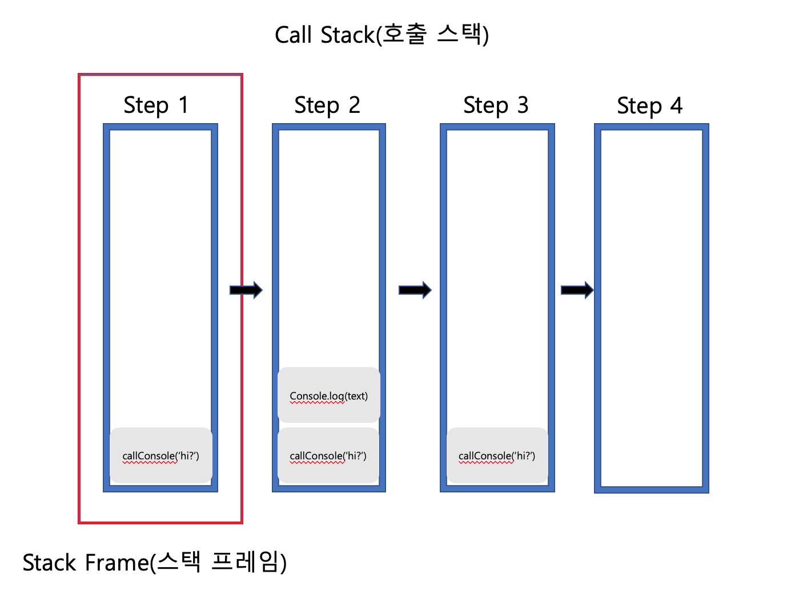
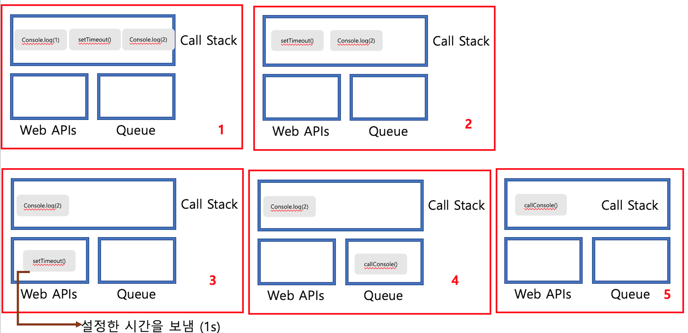

# 자바스크립트 작동원리

- 싱글쓰레드 기반
- Event Loop
- 콜백 큐 (Callback Queue)

### 자바스크립트 엔진?
---

자바스크립트 런타임(runtime)시 자바스크립트 엔진과 자바스크립트에 관여하는 다른 다양한 요소들

##### 1.엔진의 주요 구성 요소

- Memory Heap : 메모리 할당이 일어나는 곳

- Call Stack : 코드 실행에 따라 호출 스택이 쌓이는 곳

##### 2.Web APIs

- DOM, Ajax, setTimeout 과같이 브라우저에서 제공하는 API 들을 Web API라고 함

### Memory Heap
---

동적으로 생성되는 객체 (인스턴스)는 Heap에 할당 되며 힙은 대부분 구조화되지 않은 메모리 영역을 나타낸다.

### Call Stack(호출 스택)의 동작
---

자바스크립트는 Call Stack이 한 개인 (한번에 하나의 작업만 수행 가능) 싱글 쓰레드 기반 언어

Call Stack은 현재 프로그램이 어떠한 위치에서 실행 중인지 기록하는 자료구조로
함수 실행시 해당 함수는 Call Stack의 가장 상단에 존재하며, 함수 실행후 return시 
해당 함수는 Call Stack에서 제거가 됨
	
	function callConsole(text){
		console.log(text);
		return;
	}
	
	callConsole('hi?');

자바스크립트는 Call Stack이 한 개인 싱글 쓰레드 언어 임으로 Call Stack의 허용치를 넘을 경우
(예: 재귀 호출로 무한정 함수 자기 자신을 호출 할 경우) overflow에 걸려 브라우저가 에러를 발생 시킴

### Event Loop(이벤트 루프) 와 Concurrency(동시성)
---

자바스크립트는 싱글 쓰레드 기반의 언어이다. 즉 하나의 작업 (task)만 처리 할 수 있다. 하지만 웹 애플리케이션은 많은 task가 동시에 처리되는 것처럼 느껴진다. 웹 웹브라우저는 애니메이션 효과를 보여주면서 마우스 입력을 받아서 처리하고, Node.js기반의 웹서버에서는 동시에 여러 개의 HTTP 요청을 처리하기도 한다. 자바스크립트의 동시성(Concurrency)을 지원하는 것이 바로 이벤트 루프(Event Loop)이다.

##### 1. 왜 Event Loop(이벤트 루프) 인가?

[MDN의 이벤트 루프](https://developer.mozilla.org/en-US/docs/Web/JavaScript/EventLoop) 에서 왜 `이벤트 루프` 인가를 설명해주는 코드가 있다.

	while (queue.waitForMessage()) {
	  queue.processNextMessage();
	}

`queue.waitForMessage()`는 Call Stack 내에서 현재 실행중인 task가 없을 때 다음 task가 Queue에 추가될 때까지 대기하는 역할을 한다. 그리고 task가 Queue 추가되고 현재 실행중인 task가 없을 때 (주로 Call Stack이 비어 있을때) 첫 번째 task를 꺼내와 실행한다.

즉, Event Loop는 Call Stack 내에서 현재 실행중인 task가 있는지 그리고 Queue에 task가 있는지 반복하여 확인한다. 만약 Call Stack이 비어있다면 Queue 내의 task가 Call Stack으로 이동하고 실행된다.

##### 2. Task Queue

비동기 처리 함수의 콜백 함수, 비동기식 이벤트 핸들러, Timer 함수(setTimeout(), setInterval())의 콜백 함수가 보관되는 영역으로 이벤트 루프(Event Loop)에 현재 실행중인 task가 없을 때(주로 Call Stack이 비어졌을 때)에 순차적으로 Call Stack으로 이동되어 실행된다.

	function callConsole() {
		console.log('hi?');
	}
	
	console.log(1);
	setTimeout(callConsole, 1000);
	console.log(2);
	
	/**
	 * 결과 :
	 * 1
	 * 2
	 * hi?
	 */

 `1 -> 2 -> 'hi?'` 가 출력된다.

	function callConsole() {
		console.log('hi?');
	}
	
	console.log(1);
	setTimeout(callConsole, 0);
	console.log(2);
	
	/**
	 * 결과 :
	 * 1
	 * 2
	 * hi?
	 */
	 
setTimeout()의 시간을 0s 로 설정했기에 `1 -> 'hi?' -> 2`가 출력될것 같지만 결과는 위의 코드와 동일하게
 `1 -> 2 -> 'hi?'` 가 출력된다.
 
 
setTimeout() 함수는 브라우저에게 타이머 이벤트를 요청한 후에 바로 스택에서 제거된다. 그 후에 setTimeout() 콜백 함수는 설정 시간 만큼 대기를 하고 `Task Queue`로 이동하여 Call Stack(호출 스택)이 비어지게 되면 Event Loop에 의해 Call Stack으로 이동하여 실행되게 된다.

(즉, 자바스크립트의 타이머는 정확한 타이밍을 보장해주지는 않는다.)
 
 
 

      
참고 : 

- https://joshua1988.github.io/web-development/translation/javascript/how-js-works-inside-engine/
- https://developer.mozilla.org/en-US/docs/Web/JavaScript/EventLoop
- https://poiemaweb.com/js-event
- https://meetup.toast.com/posts/89
- https://www.zerocho.com/category/JavaScript/post/597f34bbb428530018e8e6e2
