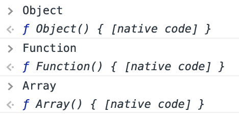

# Prototype

>
> Prototype = 원형, 원기 
>

JavaScript는 Class가 없는 프로토타입 기반 언어 이다.

프로토타입 기반 언어란 기존의 객체를 복사하여(cloning) 새로운 객체를 생성하며, 객체 원형인 프로토타입을 이용하여 새로운 객체를 만들어낸다.

이렇게 생성된 객체 역시 또 다른 객체의 원형이 될 수 있다. 
프로토타입은 객체를 확장하고 객체 지향적인 프로그래밍을 할 수 있게 해준다.

최근의 ECMA6 표준에서는 Class 문법이 추가되었지만 문법이 추가 된것이지 
자바스크립트가 클래스 기반으로 바뀌었다는 것은 아니다.

## Prototype Object와 Prototype Link

>
> Prototype = Prototype Object + Prototype Link
>

 
### 1. Object

JavaScript에서는 기본 데이터 타입인 boolean, number, string, 그리고 특별한 값인 null, undefined 빼고는 모두 객체이다. 사용자가 정의한 함수도 객체이고, new라는 연산자를 통해 생성된 것도 객체이다.

 
### 2. Prototype Object

>
> 객체는 언제나 Function(함수)로 생성된다.
>

JavaScript에서 기본 자료형 타입 (Primitive values)인 Boolean 타입, Number 타입, String 타입, Null 타입, Undefined 타입을 제외 하고는 모든 것이 객체 이다. new라는 연산자를 통해 생성된 것도 객체이고, 사용자가 정의한 함수도 객체가 될 수 있다. 그리고  **객체는 언제나 Function(함수)로 생성된다.**

	function MyFunction() {} // 함수
	
	var functionObject = new MyFunction(); // 함수로 객체 생성

 
Object와 Function, Array도 모두 함수로 정의되어 있으며, 이 모두 자바스크립트에서 기본적으로 제공하는 함수이다.

	
	/**
	 * 두개의 코드는 전혀 상관 없어 보이지만,
	 * 첫번째 코드는 사실 두번째 코드와 같다.
	 */
	 
	var obj = {}; //첫번째 코드는 사실
	
	var obj = new Object(); //다음과 같은 코드이다.
	
		
	/**
	 * Object와 같은 원리의 Array 
	 */
	 
	var myArray = [];
	
	var myArray = new Array();

  

 
### 3. 함수가 정의될 때 일어나는 2가지 사건

>
> 1.해당 함수에 Constructor(생성자) 자격 부여
> 
> 2.해당 함수의 Prototype Object 생성 및 연결
>