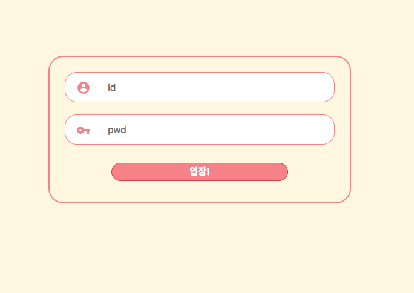

# Vue HTTP 클라이언트 활용

Promise 기반의 HTTP 클라이언트인 

`axios` 를 이용하여 API를 호출해 보도록 하겠습니다.

[axios github](https://github.com/axios/axios)

이번 예제는 로그인 예제 입니다.

	.
	|____assets
	| |____css
	| | |____login
	| | | |____login.css
	| | |____reset.css
	| |____js
	| | |____environment.js
	| | |____login
	| | | |____loginApp.js
	|____vueHttp.html
	
디렉토리 구조 입니다.

`vueHttp.html` 에는 로그인 화면에 필요한 엘리먼트가 있습니다.

`assets` 폴더에는 js 폴더와 css 폴더가 들어 있습니다.

`reset.css` 전체적인 css 기본 틀을 잡아줄 css파일 입니다.

`login.css` 로그인 레이어에 사용되는 css 입니다.

`environment.js` 전역 변수가 들어 있습니다.

`loginApp.js` 로그인을 진행하는 함수가 들어있습니다. (vue)

 

### vueHttp.html

	<!doctype html>
	<html lang="ko" >
	    <head>
	        <meta charset="UTF-8">
	        <meta name="viewport" content="width=device-width, initial-scale=1.0, maximum-scale=1.0, user-scalable=no">
	        <link rel=stylesheet href="https://fonts.googleapis.com/icon?family=Material+Icons">
	        <link rel="stylesheet" href="./assets/css/reset.css" type="text/css" />
	        <link rel="stylesheet" href="./assets/css/login/login.css" type="text/css" />
	        <title>vue http</title>
	    </head>
	    <body>
	        

	            <ul class="login-area">
	                <li class="login-box">
	                    <i class="login-input-icon material-icons">&#xE853;</i>
	                    <input class="login-input"
	                        type="text"
	                        autocomplete="off"
	                        placeholder="id"
	                        ref="userId"
	                        v-model="userId"
	                    />
	                </li>
	
	                <li class="login-box">
	                    <i class="login-input-icon material-icons">&#xE0DA;</i>
	                    <input class="login-input"
	                        type="password"
	                        autocomplete="off"
	                        placeholder="pwd"
	                        ref="userPwd"
	                        v-model="userPwd"
	                        @keyup.enter="login"
	                    />
	                </li>
	
	                <li class="login-btn-box">
	                    <button class="login-btn pointer" @click="login">입장!</button>
	                </li>
	            </ul>
	        

	    </body>
	        
	        
	        
	        
	</html>

`vueHttp.html` 입니다. css와 js를 import하고 엘리먼트를 만들어 주었습니다.
	
	
	<input class="login-input"
	    type="text"
	    autocomplete="off"
	    placeholder="id"
	    ref="userId"
	    v-model="userId"
	/>

	<input class="login-input"
	    type="password"
	    autocomplete="off"
	    placeholder="pwd"
	    ref="userPwd"
	    v-model="userPwd"
	    @keyup.enter="login"
	/>

사용자의 ID와 Password를 입력받는 `<input>` 태그에는 

`v-model`을 사용하여 `userId`와 `userPwd`를 바인딩 해주었습니다.

또한, password를 입력받는 input에는 `@keyup.enter` 이벤트를 넣어 주었습니다.

`ref`는 Vue에서 등록된 엘리먼트에 직접 접근 할 수 있도록 해주는 참조 어트리뷰트 입니다.

`ref`에 `userId`와 `userPwd`를 해당 엘리먼트의 ID로 주었습니다.

	<button class="login-btn pointer" @click="login">입장!</button>
	
`<button>`태그에는 `@click`이벤트를 주었습니다.

 

### loginApp.js

	var loginData = {
	    userId : '',
	    userPwd : '',
	};
	
	function login() {
	    var userId = this.userId.trim();
	    var userPwd = this.userPwd.trim();
	
	    if(userId === ''){
	        alert('ID 입력해주세요.');
	        this.$refs.userId.focus();
	        return;
	    }
	
	    if(userPwd === ''){
	        alert('비밀번호를 입력해주세요.');
	        this.$refs.userPwd.focus();
	        return;
	    }
	
	    var param = {
	    	...
	    };
	
	    axios.get('path/to/login', {
	        params: param
	    })
	    .then(function (response) {
	        var result = response.data;
		
	        if(result.data.code !== 1){
	            alert('ID 또는 비밀번호를 확인해 주세요.');
	            this.$refs.userId.focus();
	            return;
	        }
	
	        console.log('성공!!');
	        return;
	    })
	    .catch(function (error) {
	        console.log(error);
	    });
	
	    return;
	}
	
	
	new Vue({
	    el: '#app',
	    data : loginData,
	    methods : {
	        login : login,
	    }
	});

`loginApp.js` 파일입니다.

기본적인 데이터 세팅과 Vue 코드가 있습니다.

	new Vue({
	    el: '#app',
	    data : loginData,
	    methods : {
	        login : login,
	    }
	});

Vue 인스턴스를 생성해주고 `loginData` 데이터와 `login` 함수를 

연결해두었습니다.

 	var loginData = {
	    userId : '',
	    userPwd : '',
	};

`loginData`에는 html v-model로 바인딩 해 두었던 'userId'와 'userPwd' 변수가 있습니다.

`login()`함수에서는 사용자의 입력값을 체크한후 `axios`를 이용하여
API 를 호출 합니다.

API 호출 이후 결과 값에 따라 올바르지 않은 결과 값일 경우 

`$refs`에 등록되어 있는 엘리먼트를 참조 하여 `focus()`시켜줍니다.

`$refs`는 컴포넌트가 렌더링 된 이후 등록되며 반응적이지 않습니다.

`$refs`는 직접 자식 엘리먼트를 조작하기 위한 참조입니다.

 

#### 완성된 모습

