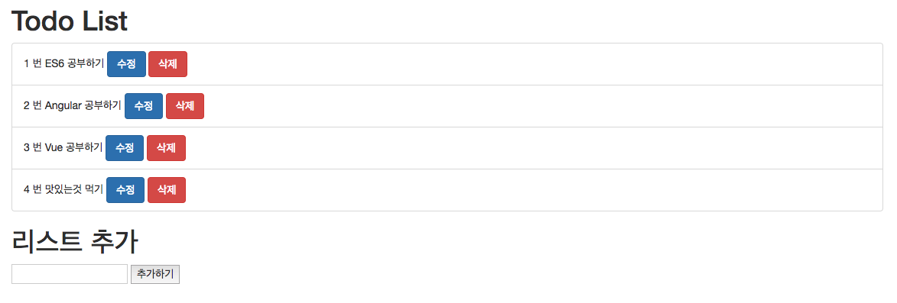
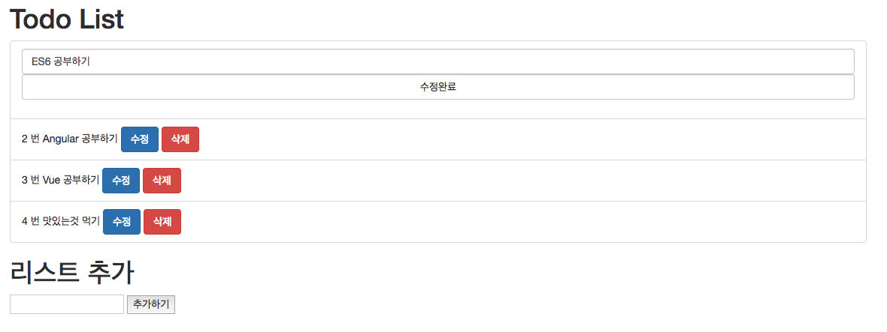

# Vue To Do List  

이전에 예제로 사용하던 To Do List를 수정과 삭제가 가능하도록 변경해 보겠습니다.

	<!doctype html>
	<html lang="ko" >
	    <head>
	        <meta charset="UTF-8">
	        <meta name="viewport" content="width=device-width, initial-scale=1.0, maximum-scale=1.0, user-scalable=no">
	        <link rel="stylesheet" href="https://maxcdn.bootstrapcdn.com/bootstrap/3.3.2/css/bootstrap.min.css">
	        <title>vue to do list</title>
	    </head>
	    <body>
	        

	            <h1>Todo List</h1>
	            <ul class="list-group">
	                <todo v-for="(todo, index) in todos" :todo="todo" :num="index" @change="changeTodoList"></todo>
	            </ul>
	
	            

	                <h1>리스트 추가</h1>
	                <input v-model="userInput" @keyup.enter="addTodoList"/>
	                <button @click="addTodoList">추가하기</button>
	            

	
	        

	
	        <template id="todoItem">
	            <li class="list-group-item">
	                

	                    {{ num + 1 }} 번 {{ todo.contents }}
	                    <button class="btn btn-primary" @click="edit">수정</button>
	                    <button class="btn btn-danger" @click="deleteTodo">삭제</button>
	                

	                

	                    <input class="form-control" v-model="todo.contents" @keyup.enter="complete"/>
	                    <button class="btn btn-default form-control" @click="complete">수정완료</button>
	                

	            </li>
	        </template>
	    </body>
	    
	    
	</html>
	
	
추가, 수정, 삭제 가 가능한 투두리스트가 만들어 졌습니다.

    <ul class="list-group">
        <todo v-for="(todo, index) in todos" :todo="todo" :num="index" @change="changeTodoList"></todo>
    </ul>
    

`<todo>`라는 태그에 v-for문으로 인자값을 'todo'와, 'num'으로 넘겨주었습니다.

'todo'에는 'todos' 배열의 항목을, 'num'에는 배열의 index를 넘겨 주었습니다.

또한, `@change="changeTodoList"`를 작성하여 부모 컴포넌트가 자식 컴포넌트에서 발생한 이벤트를 청취 할 수 있도록 하였습니다.

    <template id="todoItem">
        <li class="list-group-item">
            

                {{ num + 1 }} 번 {{ todo.contents }}
                <button class="btn btn-primary" @click="edit">수정</button>
                <button class="btn btn-danger" @click="deleteTodo">삭제</button>
            

            

                <input class="form-control" v-model="todo.contents" @keyup.enter="complete"/>
                <button class="btn btn-default form-control" @click="complete">수정완료</button>
            

        </li>
    </template>

리스트를 출력할 `<template>` 에는 v-if와 v-else 를 사용하여

해당 항목을 보여줄때와 수정할때의 view를 다르게 보여 주었습니다.

그리고, `@click` 이벤트를 사용하여 '수정', '삭제', '삭제완료' 함수를 추가 하였습니다.

    Vue.component('todo', {
        template : '#todoItem',
        props : ['todo', 'num'],
        methods : {
            edit : function () {
                this.$emit('change', this.todo, 'edit');
                return;
            },
            complete : function () {
                this.$emit('change', this.todo, 'complete');
                return;
            },
            deleteTodo : function () {
                this.$emit('change', this.todo, 'delete');
                return;
            }
        }
    });

'todo' 컴포넌트에서는 props로 'todo'와 'num'를 인자로 받고

'수정', '수정완료', '삭제' 에 대한 methods를 만들었습니다.

'수정', '수정완료', '삭제' 함수는 `$emit`을 통해 

`change `라는 이벤트를 발생 시켰습니다. 이벤트에 대한 인자로는

해당 'todo' 데이터와 각기 어떠한 작업을 원하는지에 대한 

string을 넘겨 주었습니다.

    new Vue({
        el: '#app',
        data: data,
        methods : {
            addTodoList : function () {
                if(this.userInput === ''){
                    return;
                }

                this.todos.push({contents : this.userInput, isEdit : false});
                this.userInput = '';
                return;
            },
            changeTodoList : function (data, type) {

                if(typeof type === 'undefined'){
                    return;
                }

                var index = this.todos.indexOf(data);

                if(index < 0){
                    return;
                }

                switch(type){
                    case 'edit' :
                        data.isEdit = true;
                        break;
                    case 'complete' :
                        data.isEdit = false;
                        break;
                    case 'delete' :
                        this.todos.splice(index,1);
                        break;
                }

                return;
            },
        },
    });

`addTodoList` 함수는 사용자로 부터 입력받은 텍스트를 리스트 배열에 추가 

해주는 역활을 하며,

`changeTodoList`는 'todo' 컴포넌트로 부터 발생한 

`change`라는 이벤트를 청취하여 호출 됩니다.

호출된 `changeTodoList` 함수는 string 인자로 넘겨받은 'type'에 따라

알맞는 작업을 수행 합니다.

이로서 추가, 수정, 삭제가 가능한 to do list가 완성 되었습니다.

 

완성된 투두리스트 1

완성된 투두리스트 2

